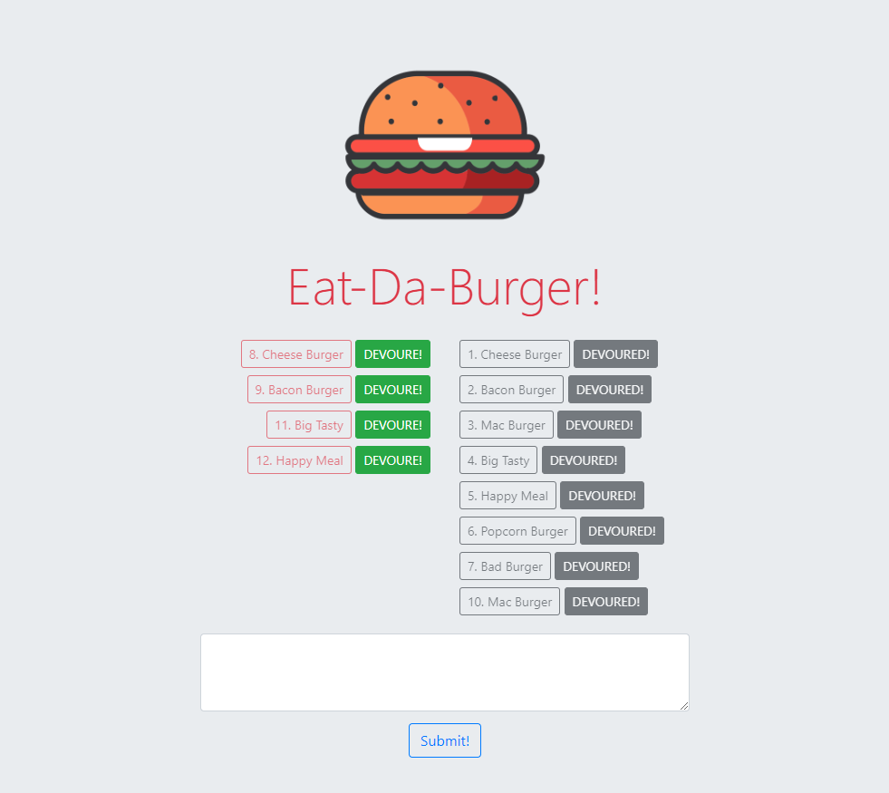

# Node Express Handlebars

### Overview

In this assignment, I'll create a burger logger with MySQL, Node, Express, Handlebars and a homemade ORM (yum!).

### Project Dependencies:
This app requires all those three node packages: `MySQL`, `Express`, `Handlebars`.

### Basic Usage:

The app runs by navigating into the directory of the app folder, and then type the command  `node server.js` in the command line terminal.

* To access the app, open the web-browser and navigate to: "localhost:3000", then the following parts will be seen in the page:
  * The top, a burger image with app's name, 
  * On the left side of the body, all burgers that haven't eaten yet are listed with "DEVOURE!" button to be devoured when pressed.
  * On the right side of the body, all burgers that had been eaten are listed with "DEVOURED!" notice.
  * The bottom, a text field is presented to add new burgers into the database, where the new burger is inserted in the non-devoured section.

This is a screenshot of the website

